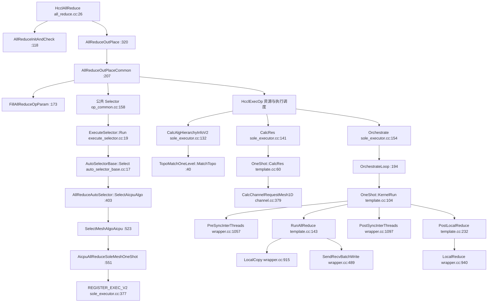
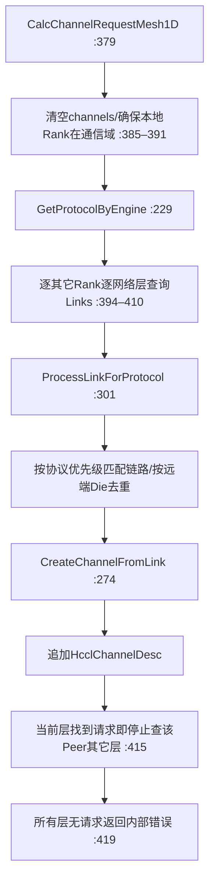

# AllReduce分阶段调用关系与分支

[返回阅读指南](../READING_GUIDE.zh-CN.md)。以下关系由固定快照逐函数审读；路径定位已转换为带逐行注释的固定提交行号。Host→AICPU为runtime发射关系，虚调用按本例注册的executor/template/UB传输类型展开。树内简写行号对应审读快照S行；树后定位表和正文链接对应新增注释后的L行。

[返回调用关系导航](CALL_RELATIONS.zh-CN.md)。入口与算法编排，第1/1页。

# AllReduce：算法选择、资源请求和 Mesh OneShot 展开

本节证据固定为 `f8af6a3`。未链接的简写数字均为该审读快照S行；链接为带本次逐行注释源码的精确L行。这里只做静态源码解释，没有在 Ascend 设备验证完成性或性能。

## 可复现的讲解条件

主例：Ascend950 新架构分流成立；OPBASE；普通 AICPU_TS 执行配置；`HCCL_USE_NEW_SELECTOR=0`；4 Rank 用户编号 0、1、2、3；第零层 MESH_1D；UB_CTP 可连接全部其它 Rank；FP32 SUM；输入输出指针合法；非严格确定性模式；非对称内存；输入字节数 `count×4 ≤ 8MiB`；首次执行且没有资源/快速发射缓存。入口调用量大于 0。CCL 容量需足以容纳至少一轮对齐后的每 Rank 完整输入槽。

这组条件说明一个确定的旧选择器 OneShot 路径。设 `HCCL_USE_NEW_SELECTOR=1` 后，运行 `SelectorEngine` 的成本模型，不能仅凭 small size 断言仍选 OneShot；OneShot 模板 `CalcCostCoeff` 还额外拒绝超过 8 Rank。公共 `AutoSelectorBase::IsSmallData` 的 <512KiB 与本算法 ≤8MiB 门槛不同。

## 主调用链及调用位置

以上图中 M 是主阅读指南展开的公共资源申请/缓存/Host→AICPU 调度范围；不能理解为 `HcclExecOp` 直接顺序调用图中全部方法。注册宏也不是每次算子调用时执行的普通函数：它建立算法名与执行器模板的查找关系。首次执行需要真正申请资源；缓存命中则使用已有序列化资源。

## 入口每条控制路径

[all_reduce.cc:L27–L82](https://github.com/zstar1003/hccl-hcomm-annotated/blob/824a8a80731bd66ef6eb78891b9aec0acfca281c/hccl/src/ops/all_reduce/all_reduce.cc#L27-L82)：版本低于 9.0 先进入兼容实现；设备不适合 OutPlace 分流则进入 inner 接口；`count==0` 在参数初始化前直接成功；其它情况才初始化/检查、记录日志并进入 OPBASE。`HcclAllReduceGraphMode:62–115` 属于其它调用模式，通过 group 取得通信域，整理外部 streams 与 scratch，进入 OFFLOAD。

`AllReduceInitAndCheck:118–147`：初始化环境配置；四个关键指针/句柄检查；获取本 Rank；取通信域名构造 tag；检查 tag、Rank、count、数据类型和归约运算。不合法返回对应错误，`CHK_RET` 保留被调用函数错误码。

`FillAllReduceOpParam:173–205`：计算 `inputSize=outputSize=count×elementSize`，保存用户地址、通信域、stream、归约运算、模式、device 信息和统一 `DataDes`。`supportSymmetricMemory` 初始为 false，公共函数随后才判断内存能力。

`AllReduceOutPlaceCommon:207–284`：设备版本 CCU 门槛、快速发射命中、AIV 回放、单 Rank、对称内存约束都是不同的提前返回/分支。主例 4 Rank 且首次无缓存进入 `Selector`，再进入 `HcclExecOp`。对称内存要求支持的引擎、受支持算法和非软件特殊归约，具体限制由 :261–278 检查。

## 旧选择器完整引擎分流

`ExecuteSelector::Run:19–57`：MC2 查优先级 18 的注册项，缺失或该项不匹配直接不支持；普通算子取对应 `opType` 的 map，按有序优先级遍历，首个 MATCH 返回成功；全部不匹配则返回不支持。

`AutoSelectorBase::Select:17–68`：HostDPUOnly 查询成功且成立时改 HOSTCPU/CPU 并立即进入 DPU 分支。否则 CCU_MS 不匹配改 CCU_SCHED，后者不匹配改 CCU_FAIL。AIV/AIV_ONLY 由 ProcessAivConfig 检查；AIV_ONLY 不匹配不能默默通过。Stars 状态下若特定 PCIe 混合场景要求 AIV 回退，改 AIV_ONLY 并返回其结果；其余进入虚派发的 `SelectAicpuAlgo`，MATCH 才将配置改 AICPU_TS。基类 Select* 空实现始终 NOT_MATCH，实际 AllReduce 使用派生实现。

| 派生候选 | 范围 | 完整分支的核心条件 |
|---|---:|---|
| CCU_MS | [all_reduce_auto_selector.cc:L41–L106](https://github.com/zstar1003/hccl-hcomm-annotated/blob/824a8a80731bd66ef6eb78891b9aec0acfca281c/hccl/src/ops/all_reduce/selector/all_reduce_auto_selector.cc#L41-L106) | strict、多拓扑层、INT8、PROD、64 位类型会被拒绝；Mesh/UBX 依据规模和数据阈值选择；原地重叠、非规则双 Die 和需绕路的双 Rank 大数据有回退路径 |
| CCU_SCHED | :168–402 | UB_RTP、三层、strict、PROD、64 位类型能力检查；多层网与单层 Mesh/UBX/Clos 分开；PCIe 混合须满足覆盖要求；数据阈值按 Rank 缩放 |
| AICPU | :403–480 | strict 先选 StrictOrderedMesh/GroupMesh；特殊类型在多层走 NHRAicpuReduce；多层按对称性、模块规模、UBOE、Level1Nhr、Mesh/Clos 分开；单层才调用 SelectMeshAlgoAicpu |
| AICPU UBX | :482–521 | Mesh 与 CLOS 实例数相等的小规模、多实例比例、特殊类型、矩形大数据及对称内存分别选算法 |
| AICPU 单层 | :523–595 | Mesh1D、Clos、Mesh1D+Clos PCIe 混合、非 PCIe UBX、未知拓扑都有明确分支 |
| AIV | :597–690 | 排除不支持网络/层次、类型/运算、strict；再按 Rank、CCL 容量和大小选择 OneShot/TwoShot，或 NOT_MATCH |
| HostDPU | :692–729 | 显式配置和多层网络决定 SequenceMeshNHR/流水线；单层不匹配 |

主例具体进入 `SelectAicpuAlgo:403`，strict 条件 :412 为 false，多层条件 :432 为 false，于 :475 转入 `SelectMeshAlgoAicpu:523`。`isDataTypeOrReduceTypeSpecial:529–532` 为 false；Mesh1D 条件 :543 为 true；双 Rank 绕路 :547 为 false；`dataSize <= 8MiB` :550 为 true，于 :551 选 OneShot。

若特殊类型/PROD：Mesh1D 的 ≤8MiB 也可以选 OneShot，但归约必须走软件；若双 Rank 可用二层网且数据 ≥8MiB：先选 MeshConcur；超过小数据阈值后再按平方缩放的 32MiB 门槛与 4GiB 标志选 ChunkTwoShot/Concur/TwoShot。Clos 按特殊类型选 NHRAicpuReduce 或 NHRMultiLink。Mesh1DClos 若 PCIe 混合且全层 Mesh 覆盖，可走 Mesh 阈值，否则是 Parallel/PipeLine/Sequence 系列；非 PCIe 调 UBX。

## 新成本选择器作为旁支

`SelectorEngine::Run:252–307`：满足 AIV 回退条件且非 AIV_ONLY 时先改 AIV_ONLY 配置；tuner 初始化标记缺失时先初始化 tuner 并建立 Host CPU context 标记；按当前引擎获得或首次初始化成本模型；生成本次数据规模的成本表并交 tuner 改写；`SelectMinCost:369–444` 比较；删除临时成本表；失败则打印诊断/尝试 AIV_ONLY 诊断辅助；成功记录算法。

`SelectMinCost`：表为空或 count≤0 返回不支持；跳过空算法名和负成本；严格更低更新 winner；同值只记录并列，不替换首次最小项；所有项无效返回不支持；成功写算法名及按前缀识别的执行配置。主例不用这条路径。

## 拓扑匹配与 Channel 描述请求

OneShot 注册 :377–393 绑定 `InsV2AllReduceSoleExecutor<TopoMatchOneLevel,InsTempAllReduceMesh1DOneShot>`，声明最多一层以及 Mesh1D / Mesh1DClos 类型约束（不含纯 Clos）。`CalcAlgHierarchyInfoV2:132–139` 带实际 `AlgAttrs` 调 `MatchTopo:40–75`；后者检查物理拓扑非空/Rank 数非零，调用 `CollectEffectiveIndices`，再用 `PickFullLocalRanksLayer:23–37` 按有效层顺序找覆盖全部 Rank 的层。HostCPU 额外要求 Host 位置。找不到返回不支持。

`OneShot::CalcRes:60–75` 申请总数 `max(rankSize,1)` 的 Thread（从 Thread 数总数减 1），各从 Thread 一个 notify 槽，主 Thread 每从 Thread一个汇合槽；向上提供通道请求列表。此函数 :73 warning 文本说暂未计算，但实际 :65–72 已计算资源，文档以实现为准。

`GetProtocolByEngine:229–272`：AICPU/AICPU_TS 优先 UB_CTP，其次 PCIe、UBOE；9.2+ 再包含 UB_RTP；CCU 只 UB_CTP；AIV UB_MEM/PCIe；CPU UB_CTP/ROCE；CPU_TS ROCE；未知 engine 仅警告。低版本兼容编译分支可能不填协议列表。`ProcessLinkForProtocol:301–331` 只选择第一个能匹配链路的协议，不继续低优先级协议；本地源端点 Die 查询成功才去重，失败时仍允许加入该匹配链路。`CreateChannelFromLink:274–299` 填 remoteRank、本地/远端 endpoint loc/protocol/地址与通道 protocol，并请求 NORMAL_NOTIFY_NUM；`HcclChannelDescInit` 返回码未检查。到此产生的是描述，不是运行时 handle。

## 分轮容量与每轮数据布局

`Orchestrate:154–192` 恢复通道/Thread/窗口等资源，读取元素数和类型，校验乘法溢出，转 `OrchestrateLoop:194–303`。后者构造模板资源和数据参数，OneShot 的 `CalcScratchMultiple:77–83` 返回 Rank 数 N。

AICPU_TS 的 transportBound=CCL 容量；scratchBound=`floor(CCL容量/N/对齐字节数)×对齐字节数`。每轮字节上限是二者较小值，元素上限再除以 elementSize。元素大小为0或每轮可处理元素数为0返回内部错误。轮数是 `ceil(totalCount/maxCount)`；末轮用剩余 count。对称内存强制一轮覆盖总量。输入输出偏移都是 `processedCount×elementSize`，CCL 每轮复用偏移0。

4 Rank、某轮 S 字节时，每个 Rank 的 CCL 按发送源 Rank 保存全量输入：slot0=[0,S)，slot1=[S,2S)，slot2=[2S,3S)，slot3=[3S,4S)。`CalcSlice:85–102` 给每个 Rank 一片 S 字节并校验最后终点。小输入仍可能因 CCL 容量不足而分多轮；不能由 8MiB 的选择阈值推断恰好一轮。

## OneShot 每轮普通内存协议

`KernelRun:104–141` 设置本轮 count、字节数、type、对称标志和软件归约标志；要求 Thread 数恰好 N；计算槽；N>1 时前同步；RunAllReduce；N>1 时后同步；普通内存 PostLocalReduce。

`RunAllReduce:143–205`：主 Thread 先把自己输入完整复制到自己输出。N=1 直接结束。其余 `queIdx=1..N-1` 各使用一个从 Thread，代码直接用本地用户 Rank 计算 Peer 索引 `(myRank_+queIdx)%N`，再映射到用户 Rank；本例连续0..3。向每个 Peer 将本 Rank 全量用户输入写到其远端 CCL 的本地用户 Rank 对应槽。接收方向对象也组装了 rxSlices，但普通 Write 包装实际只消费 txSlices，rx Peer 的写入通过通知等待完成，不能把 rxSlices 描述解释成额外主动接收拷贝。

`SendRecvBatchWrite:489–503 → DoSendRecvBatchTx:253–279` 的四步顺序：

1. 向接收 Peer 发 ACK，表示本端接收槽可写。
2. 等发送 Peer 的 ACK，表示其接收槽可写。
3. 向发送 Peer 写入全量输入，然后发 DATA_SIGNAL。
4. 等接收 Peer 的 DATA_SIGNAL，表示其写入本端输入完成。

主例 send/recv Peer 是同一个其它 Rank。批能力未支持时 :259 fallback `SendRecvWrite:448–487`，同样握手后逐片 Write。支持时 `RunBatchTransfer:137–168` 跳过零长度片、构造 WRITE 描述数组并提交 HCOMM；空描述数组不提交数据原语但外层仍需要协议通知。仅末条 WRITE_REDUCE 能融合 DATA_SIGNAL，普通 WRITE 的通知不能融合，`RunBatchTransferAndNotify:171–185` 另发。

`PostSyncInterThreads:1097–1133` 在主 Thread 先排入各完成槽 Wait，再在各从 Thread 排入 Record；这是不同队列的依赖，不是 Host 阻塞式先等后发。完成汇合之后，`PostLocalReduce:232–267` 枚举除自身外每个本端 CCL 槽，逐个归约到本 Rank 用户输出。变量 `RemotePtr` 实际等于本端 CCL addr；没有在这里发起远端 Read。

这是 N−1 Peer 的全量输入交换，再本地合并，不是此实现内的 ReduceScatter→AllGather 两阶段。FP32 SUM `LocalReduce:940–969` 走 `HcommLocalReduceOnThread`，长度参数是元素 count；`LocalCopy:915–936` 走 `HcommLocalCopyOnThread`，长度参数是字节 size。两者均跳过零长片并检查源目标字节大小一致。

## 对称内存和软件归约旁支

对称内存在 `RunAllReduce:172–174` 用 `SymmetricReadReduce:207–230`，把 Peer 远端用户输入直接 ReadReduce 到本端输出；不走普通 CCL 槽的 PostLocalReduce。`SendRecvBatchReadReduce:879–911 → DoSendRecvBatchRx:326–349` ACK/DATA方向对应读取协议：通知 send Peer 本端源可读，等 recv Peer 源可读，读归约 recv Peer，通知 recv Peer 读取完成，等 send Peer 读本端完成。批能力缺失 fallback `SendRecvReadReduce:826–877`；每片归约要求 count×元素大小等于字节容量。

INT64/UINT64/FP64 或 PROD 在 `LocalReduce:945–949` 进入 `AicpuReduce:1313–1372`。PostLocalReduce 中提前 `BatchModeEnd/Start` 并 Join 全部 Thread，保证 CPU 软件访问时输入已就绪。AicpuReduce 当前不使用 thread 排队，按 type 显式分发；不支持类型返回内部错误。FP16 转 FP32 运算再转回；其它模板 :1375–1414 逐元素 SUM/PROD/MAX/MIN；INT8/INT32 PROD 经过无符号中间值；未知 reduceOp 返回内部错误。

## 错误和完成语义必须保留

- 主例拓扑、Thread 数、CCL 容量、Peer 通道和片大小必须满足检查；原语提交失败通过 CHK_RET 或 CHK_PRT_RET 返回。不能把正常路径示意当作无错误保证。
- `KernelRun:137` 使用 `CHK_PRT(PostLocalReduce(...))`，该宏只打印错误，之后 :140 返回成功。因此本地归约失败可以被掩盖；本次解释不修改实现，文档不能声称所有归约错误均传回 API。
- `channels.at(peer)[0]` 假设存在该 Peer 且列表非空；不是显式 HcclResult 参数检查。4 Rank 原编号0..3保证本例槽索引可直接对应；其它子通信域重编号需要另行审计。
- `CreateChannelFromLink:280` 初始化返回码未检查；Die 查询失败不向上错误返回；warning 文本不等于实际资源行为。
- success/完成日志首先说明组织或提交路径成功；设备完成依赖 Thread/Channel Notify、Join 或上层流同步，不得以 API return 或 log 代替所有设备任务已经结束。

## 已展开范围与未展开 helpers

本节逐行说明纳入统一[机器清单](line-notes.json)，由生成器核对固定快照、完整范围覆盖和源码插入。

| 未在本子范围逐行展开的 helper | 固定源码位置 | 作用及归属 |
|---|---|---|
| 公共 Selector/HcclExecOp/缓存、资源申请、kernel launch | hccl/src/ops/op_common/op_common.cc、algorithm/template/aicpu/kernel_launch.cc | 父模块逐行展开；连接选择器、执行器与 HCOMM |
| SelectorRegistry::Global/GetSelectorsByOpType | [selector_registry.cc:L20](https://github.com/zstar1003/hccl-hcomm-annotated/blob/824a8a80731bd66ef6eb78891b9aec0acfca281c/hccl/src/ops/op_common/selector/selector_registry.cc#L20) / :49 | 旧选择器注册和按算子取 map |
| CollectEffectiveIndices | [topo_match_base_v2.cc:L102](https://github.com/zstar1003/hccl-hcomm-annotated/blob/824a8a80731bd66ef6eb78891b9aec0acfca281c/hccl/src/ops/op_common/algorithm/topo_match/topo_match_base_v2.cc#L102) | 按引擎筛选有效物理层 |
| InsAlgTemplateBase 构造 | [alg_v2_template_base.cc:L15](https://github.com/zstar1003/hccl-hcomm-annotated/blob/824a8a80731bd66ef6eb78891b9aec0acfca281c/hccl/src/ops/op_common/algorithm/template/alg_v2_template_base.cc#L15) | 保存子通信域和本地用户 Rank；未在基类重编号 |
| TraceDataSlice/TraceBatchSummary | [alg_data_trans_wrapper.cc:L62](https://github.com/zstar1003/hccl-hcomm-annotated/blob/824a8a80731bd66ef6eb78891b9aec0acfca281c/hccl/src/ops/op_common/algorithm/template/wrapper/alg_data_trans_wrapper.cc#L62) / :66 | 仅诊断数据片/描述数，不改变协议 |
| FP16/FP32 转换 helpers | 同 wrapper 文件 :1137–1290 | 软件 FP16 算术转换实现 |
| HcclHcommBatchTransferOnThread | [hcomm_primitives_dl.cc:L88](https://github.com/zstar1003/hccl-hcomm-annotated/blob/824a8a80731bd66ef6eb78891b9aec0acfca281c/hccl/src/common/hcomm_dlsym/hcomm_primitives_dl.cc#L88) | 批 ABI 描述适配和动态符号调用；父模块展开 |
| HcclThreadNotifyWaitOnThreadDefault | 同动态桥文件 :176 | Thread 等待默认超时/能力桥；父模块展开 |
| HcclChannelNotifyWaitOnThreadDefault | 同动态桥文件 :184 | Channel 等待默认超时/能力桥；父模块展开 |
| IsNewSelectorEnabled | [alg_env_config.cc:L1233](https://github.com/zstar1003/hccl-hcomm-annotated/blob/824a8a80731bd66ef6eb78891b9aec0acfca281c/hccl/src/common/alg_env_config.cc#L1233) | 返回解析后的开关；父模块展开环境解析 |
| SelectorEngine::LogAivOnlyNotMatch/LogSelectedAlgo/QueryTemplateInfo/QueryExecutorName | [selector_engine.cc:L194](https://github.com/zstar1003/hccl-hcomm-annotated/blob/824a8a80731bd66ef6eb78891b9aec0acfca281c/hccl/src/ops/op_common/selector/selector_engine.cc#L194) / :309 / :334 / :355 | 新选择器日志和注册查询，非主例的提交路径 |
| SoleExecutor FastLaunchSaveCtx/OrchestrateFastLaunch | [ins_v2_all_reduce_sole_executor.cc:L529](https://github.com/zstar1003/hccl-hcomm-annotated/blob/824a8a80731bd66ef6eb78891b9aec0acfca281c/hccl/src/ops/all_reduce/algorithm/executor/ins_v2_all_reduce_sole_executor.cc#L529) / :349 | CCU 快速发射旁支，主例 AICPU_TS 首次执行不走 |

`GetRankFullMeshLayers:[channel.cc:L429](https://github.com/zstar1003/hccl-hcomm-annotated/blob/824a8a80731bd66ef6eb78891b9aec0acfca281c/hccl/src/ops/op_common/algorithm/executor/channel/channel.cc#L429) 没有被本例 `CalcChannelRequestMesh1D` 调用，不列为其实际 helper。当前 hccl ops 也没有 `GetChannelInfo` 同名定义，真实描述构造是 `CreateChannelFromLink`，实际公共资源恢复是 `BuildChannelInfo/RestoreChannelMap` 对应父范围。

## 调用边的精确源码证据

| Caller | 调用行 | Callee | 定义范围 | 条件和数据流 |
|---|---|---|---|---|
| `HcclAllReduce` | [all_reduce.cc:L65](https://github.com/zstar1003/hccl-hcomm-annotated/blob/824a8a80731bd66ef6eb78891b9aec0acfca281c/hccl/src/ops/all_reduce/all_reduce.cc#L65) | `AllReduceInitAndCheck` | [all_reduce.cc:L179–L227](https://github.com/zstar1003/hccl-hcomm-annotated/blob/824a8a80731bd66ef6eb78891b9aec0acfca281c/hccl/src/ops/all_reduce/all_reduce.cc#L179-L227) | 非零新架构调用完成环境与参数检查 |
| `HcclAllReduce` | [all_reduce.cc:L74](https://github.com/zstar1003/hccl-hcomm-annotated/blob/824a8a80731bd66ef6eb78891b9aec0acfca281c/hccl/src/ops/all_reduce/all_reduce.cc#L74) | `AllReduceOutPlace` | [all_reduce.cc:L535–L553](https://github.com/zstar1003/hccl-hcomm-annotated/blob/824a8a80731bd66ef6eb78891b9aec0acfca281c/hccl/src/ops/all_reduce/all_reduce.cc#L535-L553) | 传用户地址/count/type/op/comm/stream，进入OPBASE |
| `AllReduceOutPlace` | [all_reduce.cc:L545](https://github.com/zstar1003/hccl-hcomm-annotated/blob/824a8a80731bd66ef6eb78891b9aec0acfca281c/hccl/src/ops/all_reduce/all_reduce.cc#L545) | `AllReduceOutPlaceCommon` | [all_reduce.cc:L335–L467](https://github.com/zstar1003/hccl-hcomm-annotated/blob/824a8a80731bd66ef6eb78891b9aec0acfca281c/hccl/src/ops/all_reduce/all_reduce.cc#L335-L467) | 以 OPBASE 和默认外部资源包进入共享分发 |
| `AllReduceOutPlaceCommon` | [all_reduce.cc:L347](https://github.com/zstar1003/hccl-hcomm-annotated/blob/824a8a80731bd66ef6eb78891b9aec0acfca281c/hccl/src/ops/all_reduce/all_reduce.cc#L347) | `FillAllReduceOpParam` | [all_reduce.cc:L275–L332](https://github.com/zstar1003/hccl-hcomm-annotated/blob/824a8a80731bd66ef6eb78891b9aec0acfca281c/hccl/src/ops/all_reduce/all_reduce.cc#L275-L332) | 组装统一OpParam，count转字节容量 |
| `ExecuteSelector::Run` | [execute_selector.cc:L70](https://github.com/zstar1003/hccl-hcomm-annotated/blob/824a8a80731bd66ef6eb78891b9aec0acfca281c/hccl/src/ops/op_common/selector/execute_selector.cc#L70) | `AutoSelectorBase::Select` | [auto_selector_base.cc:L18–L119](https://github.com/zstar1003/hccl-hcomm-annotated/blob/824a8a80731bd66ef6eb78891b9aec0acfca281c/hccl/src/ops/op_common/selector/auto_selector_base.cc#L18-L119) | 普通算子map按优先级虚派发 |
| `AutoSelectorBase::Select` | [auto_selector_base.cc:L101](https://github.com/zstar1003/hccl-hcomm-annotated/blob/824a8a80731bd66ef6eb78891b9aec0acfca281c/hccl/src/ops/op_common/selector/auto_selector_base.cc#L101) | `AllReduceAutoSelector::SelectAicpuAlgo` | [all_reduce_auto_selector.cc:L722–L869](https://github.com/zstar1003/hccl-hcomm-annotated/blob/824a8a80731bd66ef6eb78891b9aec0acfca281c/hccl/src/ops/all_reduce/selector/all_reduce_auto_selector.cc#L722-L869) | Stars状态且不需AIV回退 |
| `AllReduceAutoSelector::SelectAicpuAlgo` | [all_reduce_auto_selector.cc:L860](https://github.com/zstar1003/hccl-hcomm-annotated/blob/824a8a80731bd66ef6eb78891b9aec0acfca281c/hccl/src/ops/all_reduce/selector/all_reduce_auto_selector.cc#L860) | `AllReduceAutoSelector::SelectMeshAlgoAicpu` | [all_reduce_auto_selector.cc:L948–L1088](https://github.com/zstar1003/hccl-hcomm-annotated/blob/824a8a80731bd66ef6eb78891b9aec0acfca281c/hccl/src/ops/all_reduce/selector/all_reduce_auto_selector.cc#L948-L1088) | 非严格模式且拓扑层数不大于1 |
| `TopoMatchOneLevel::MatchTopo` | [topo_match_one_level.cc:L92](https://github.com/zstar1003/hccl-hcomm-annotated/blob/824a8a80731bd66ef6eb78891b9aec0acfca281c/hccl/src/ops/op_common/algorithm/topo_match/topo_match_one_level.cc#L92) | `PickFullLocalRanksLayer` | [topo_match_one_level.cc:L24–L52](https://github.com/zstar1003/hccl-hcomm-annotated/blob/824a8a80731bd66ef6eb78891b9aec0acfca281c/hccl/src/ops/op_common/algorithm/topo_match/topo_match_one_level.cc#L24-L52) | 有效层内要求覆盖全部Rank，Host位置按引擎限制 |
| `InsV2AllReduceSoleExecutor::CalcRes` | [ins_v2_all_reduce_sole_executor.cc:L241](https://github.com/zstar1003/hccl-hcomm-annotated/blob/824a8a80731bd66ef6eb78891b9aec0acfca281c/hccl/src/ops/all_reduce/algorithm/executor/ins_v2_all_reduce_sole_executor.cc#L241) | `InsTempAllReduceMesh1DOneShot::CalcRes` | [ins_temp_all_reduce_mesh_1D_one_shot.cc:L100–L128](https://github.com/zstar1003/hccl-hcomm-annotated/blob/824a8a80731bd66ef6eb78891b9aec0acfca281c/hccl/src/ops/all_reduce/algorithm/template/aicpu/ins_temp_all_reduce_mesh_1D_one_shot.cc#L100-L128) | 注册模板实例产出Thread/notify/channel请求 |
| `InsTempAllReduceMesh1DOneShot::CalcRes` | [ins_temp_all_reduce_mesh_1D_one_shot.cc:L120](https://github.com/zstar1003/hccl-hcomm-annotated/blob/824a8a80731bd66ef6eb78891b9aec0acfca281c/hccl/src/ops/all_reduce/algorithm/template/aicpu/ins_temp_all_reduce_mesh_1D_one_shot.cc#L120) | `CalcChannelRequestMesh1D` | [channel.cc:L476–L574](https://github.com/zstar1003/hccl-hcomm-annotated/blob/824a8a80731bd66ef6eb78891b9aec0acfca281c/hccl/src/ops/op_common/algorithm/executor/channel/channel.cc#L476-L574) | 第零层Mesh对每其它Rank产生通道描述 |
| `CalcChannelRequestMesh1D` | [channel.cc:L504](https://github.com/zstar1003/hccl-hcomm-annotated/blob/824a8a80731bd66ef6eb78891b9aec0acfca281c/hccl/src/ops/op_common/algorithm/executor/channel/channel.cc#L504) | `GetProtocolByEngine` | [channel.cc:L230–L311](https://github.com/zstar1003/hccl-hcomm-annotated/blob/824a8a80731bd66ef6eb78891b9aec0acfca281c/hccl/src/ops/op_common/algorithm/executor/channel/channel.cc#L230-L311) | 按param.engine选择协议优先级 |
| `CalcChannelRequestMesh1D` | [channel.cc:L542](https://github.com/zstar1003/hccl-hcomm-annotated/blob/824a8a80731bd66ef6eb78891b9aec0acfca281c/hccl/src/ops/op_common/algorithm/executor/channel/channel.cc#L542) | `ProcessLinkForProtocol` | [channel.cc:L367–L427](https://github.com/zstar1003/hccl-hcomm-annotated/blob/824a8a80731bd66ef6eb78891b9aec0acfca281c/hccl/src/ops/op_common/algorithm/executor/channel/channel.cc#L367-L427) | 传当前层RankGraph链路列表和Peer |
| `ProcessLinkForProtocol` | [channel.cc:L409](https://github.com/zstar1003/hccl-hcomm-annotated/blob/824a8a80731bd66ef6eb78891b9aec0acfca281c/hccl/src/ops/op_common/algorithm/executor/channel/channel.cc#L409) | `CreateChannelFromLink` | [channel.cc:L314–L364](https://github.com/zstar1003/hccl-hcomm-annotated/blob/824a8a80731bd66ef6eb78891b9aec0acfca281c/hccl/src/ops/op_common/algorithm/executor/channel/channel.cc#L314-L364) | 匹配协议且本地源Die未重复，或Die查询失败 |
| `InsV2AllReduceSoleExecutor::Orchestrate` | [ins_v2_all_reduce_sole_executor.cc:L306](https://github.com/zstar1003/hccl-hcomm-annotated/blob/824a8a80731bd66ef6eb78891b9aec0acfca281c/hccl/src/ops/all_reduce/algorithm/executor/ins_v2_all_reduce_sole_executor.cc#L306) | `InsV2AllReduceSoleExecutor::OrchestrateLoop` | [ins_v2_all_reduce_sole_executor.cc:L325–L527](https://github.com/zstar1003/hccl-hcomm-annotated/blob/824a8a80731bd66ef6eb78891b9aec0acfca281c/hccl/src/ops/all_reduce/algorithm/executor/ins_v2_all_reduce_sole_executor.cc#L325-L527) | 恢复资源、检查总字节乘法后分轮 |
| `InsV2AllReduceSoleExecutor::OrchestrateLoop` | [ins_v2_all_reduce_sole_executor.cc:L400](https://github.com/zstar1003/hccl-hcomm-annotated/blob/824a8a80731bd66ef6eb78891b9aec0acfca281c/hccl/src/ops/all_reduce/algorithm/executor/ins_v2_all_reduce_sole_executor.cc#L400) | `InsTempAllReduceMesh1DOneShot::CalcScratchMultiple` | [ins_temp_all_reduce_mesh_1D_one_shot.cc:L131–L143](https://github.com/zstar1003/hccl-hcomm-annotated/blob/824a8a80731bd66ef6eb78891b9aec0acfca281c/hccl/src/ops/all_reduce/algorithm/template/aicpu/ins_temp_all_reduce_mesh_1D_one_shot.cc#L131-L143) | OneShot返回N，CCL按N完整输入槽限制每轮容量 |
| `InsV2AllReduceSoleExecutor::OrchestrateLoop` | [ins_v2_all_reduce_sole_executor.cc:L506](https://github.com/zstar1003/hccl-hcomm-annotated/blob/824a8a80731bd66ef6eb78891b9aec0acfca281c/hccl/src/ops/all_reduce/algorithm/executor/ins_v2_all_reduce_sole_executor.cc#L506) | `InsTempAllReduceMesh1DOneShot::KernelRun` | [ins_temp_all_reduce_mesh_1D_one_shot.cc:L182–L255](https://github.com/zstar1003/hccl-hcomm-annotated/blob/824a8a80731bd66ef6eb78891b9aec0acfca281c/hccl/src/ops/all_reduce/algorithm/template/aicpu/ins_temp_all_reduce_mesh_1D_one_shot.cc#L182-L255) | 逐轮传count、in/out字节偏移、复用CCL |
| `InsTempAllReduceMesh1DOneShot::KernelRun` | [ins_temp_all_reduce_mesh_1D_one_shot.cc:L221](https://github.com/zstar1003/hccl-hcomm-annotated/blob/824a8a80731bd66ef6eb78891b9aec0acfca281c/hccl/src/ops/all_reduce/algorithm/template/aicpu/ins_temp_all_reduce_mesh_1D_one_shot.cc#L221) | `InsTempAllReduceMesh1DOneShot::CalcSlice` | [ins_temp_all_reduce_mesh_1D_one_shot.cc:L146–L179](https://github.com/zstar1003/hccl-hcomm-annotated/blob/824a8a80731bd66ef6eb78891b9aec0acfca281c/hccl/src/ops/all_reduce/algorithm/template/aicpu/ins_temp_all_reduce_mesh_1D_one_shot.cc#L146-L179) | 构造N个完整S字节数据槽 |
| `InsTempAllReduceMesh1DOneShot::KernelRun` | [ins_temp_all_reduce_mesh_1D_one_shot.cc:L229](https://github.com/zstar1003/hccl-hcomm-annotated/blob/824a8a80731bd66ef6eb78891b9aec0acfca281c/hccl/src/ops/all_reduce/algorithm/template/aicpu/ins_temp_all_reduce_mesh_1D_one_shot.cc#L229) | `PreSyncInterThreads` | [alg_data_trans_wrapper.cc:L1406–L1470](https://github.com/zstar1003/hccl-hcomm-annotated/blob/824a8a80731bd66ef6eb78891b9aec0acfca281c/hccl/src/ops/op_common/algorithm/template/wrapper/alg_data_trans_wrapper.cc#L1406-L1470) | N>1，各从Thread等自己的slot0 |
| `InsTempAllReduceMesh1DOneShot::KernelRun` | [ins_temp_all_reduce_mesh_1D_one_shot.cc:L233](https://github.com/zstar1003/hccl-hcomm-annotated/blob/824a8a80731bd66ef6eb78891b9aec0acfca281c/hccl/src/ops/all_reduce/algorithm/template/aicpu/ins_temp_all_reduce_mesh_1D_one_shot.cc#L233) | `InsTempAllReduceMesh1DOneShot::RunAllReduce` | [ins_temp_all_reduce_mesh_1D_one_shot.cc:L258–L369](https://github.com/zstar1003/hccl-hcomm-annotated/blob/824a8a80731bd66ef6eb78891b9aec0acfca281c/hccl/src/ops/all_reduce/algorithm/template/aicpu/ins_temp_all_reduce_mesh_1D_one_shot.cc#L258-L369) | 本地复制和逐Peer交换 |
| `InsTempAllReduceMesh1DOneShot::RunAllReduce` | [ins_temp_all_reduce_mesh_1D_one_shot.cc:L281](https://github.com/zstar1003/hccl-hcomm-annotated/blob/824a8a80731bd66ef6eb78891b9aec0acfca281c/hccl/src/ops/all_reduce/algorithm/template/aicpu/ins_temp_all_reduce_mesh_1D_one_shot.cc#L281) | `LocalCopy` | [alg_data_trans_wrapper.cc:L1218–L1257](https://github.com/zstar1003/hccl-hcomm-annotated/blob/824a8a80731bd66ef6eb78891b9aec0acfca281c/hccl/src/ops/op_common/algorithm/template/wrapper/alg_data_trans_wrapper.cc#L1218-L1257) | 主Thread用户input→output，长度字节 |
| `InsTempAllReduceMesh1DOneShot::RunAllReduce` | [ins_temp_all_reduce_mesh_1D_one_shot.cc:L360](https://github.com/zstar1003/hccl-hcomm-annotated/blob/824a8a80731bd66ef6eb78891b9aec0acfca281c/hccl/src/ops/all_reduce/algorithm/template/aicpu/ins_temp_all_reduce_mesh_1D_one_shot.cc#L360) | `SendRecvBatchWrite` | [alg_data_trans_wrapper.cc:L697–L725](https://github.com/zstar1003/hccl-hcomm-annotated/blob/824a8a80731bd66ef6eb78891b9aec0acfca281c/hccl/src/ops/op_common/algorithm/template/wrapper/alg_data_trans_wrapper.cc#L697-L725) | 普通内存，从Thread用户input→Peer远端CCL本Rank槽 |
| `SendRecvBatchWrite` | [alg_data_trans_wrapper.cc:L723](https://github.com/zstar1003/hccl-hcomm-annotated/blob/824a8a80731bd66ef6eb78891b9aec0acfca281c/hccl/src/ops/op_common/algorithm/template/wrapper/alg_data_trans_wrapper.cc#L723) | `DoSendRecvBatchTx` | [alg_data_trans_wrapper.cc:L365–L413](https://github.com/zstar1003/hccl-hcomm-annotated/blob/824a8a80731bd66ef6eb78891b9aec0acfca281c/hccl/src/ops/op_common/algorithm/template/wrapper/alg_data_trans_wrapper.cc#L365-L413) | 传WRITE描述构造lambda与SendRecvWrite fallback |
| `DoSendRecvBatchTx` | [alg_data_trans_wrapper.cc:L403](https://github.com/zstar1003/hccl-hcomm-annotated/blob/824a8a80731bd66ef6eb78891b9aec0acfca281c/hccl/src/ops/op_common/algorithm/template/wrapper/alg_data_trans_wrapper.cc#L403) | `RunBatchTransferAndNotify` | [alg_data_trans_wrapper.cc:L267–L297](https://github.com/zstar1003/hccl-hcomm-annotated/blob/824a8a80731bd66ef6eb78891b9aec0acfca281c/hccl/src/ops/op_common/algorithm/template/wrapper/alg_data_trans_wrapper.cc#L267-L297) | 批接口支持：ACK后批写并通知DATA_SIGNAL |
| `RunBatchTransferAndNotify` | [alg_data_trans_wrapper.cc:L281](https://github.com/zstar1003/hccl-hcomm-annotated/blob/824a8a80731bd66ef6eb78891b9aec0acfca281c/hccl/src/ops/op_common/algorithm/template/wrapper/alg_data_trans_wrapper.cc#L281) | `RunBatchTransfer` | [alg_data_trans_wrapper.cc:L206–L264](https://github.com/zstar1003/hccl-hcomm-annotated/blob/824a8a80731bd66ef6eb78891b9aec0acfca281c/hccl/src/ops/op_common/algorithm/template/wrapper/alg_data_trans_wrapper.cc#L206-L264) | 过滤零长度片并批提交，回传通知融合标志 |
| `InsTempAllReduceMesh1DOneShot::KernelRun` | [ins_temp_all_reduce_mesh_1D_one_shot.cc:L241](https://github.com/zstar1003/hccl-hcomm-annotated/blob/824a8a80731bd66ef6eb78891b9aec0acfca281c/hccl/src/ops/all_reduce/algorithm/template/aicpu/ins_temp_all_reduce_mesh_1D_one_shot.cc#L241) | `PostSyncInterThreads` | [alg_data_trans_wrapper.cc:L1475–L1538](https://github.com/zstar1003/hccl-hcomm-annotated/blob/824a8a80731bd66ef6eb78891b9aec0acfca281c/hccl/src/ops/op_common/algorithm/template/wrapper/alg_data_trans_wrapper.cc#L1475-L1538) | N>1，从Thread尾Record→主Thread逐槽Wait |
| `InsTempAllReduceMesh1DOneShot::KernelRun` | [ins_temp_all_reduce_mesh_1D_one_shot.cc:L247](https://github.com/zstar1003/hccl-hcomm-annotated/blob/824a8a80731bd66ef6eb78891b9aec0acfca281c/hccl/src/ops/all_reduce/algorithm/template/aicpu/ins_temp_all_reduce_mesh_1D_one_shot.cc#L247) | `InsTempAllReduceMesh1DOneShot::PostLocalReduce` | [ins_temp_all_reduce_mesh_1D_one_shot.cc:L420–L482](https://github.com/zstar1003/hccl-hcomm-annotated/blob/824a8a80731bd66ef6eb78891b9aec0acfca281c/hccl/src/ops/all_reduce/algorithm/template/aicpu/ins_temp_all_reduce_mesh_1D_one_shot.cc#L420-L482) | 普通内存汇合后归约；CHK_PRT只打印错误 |
| `InsTempAllReduceMesh1DOneShot::PostLocalReduce` | [ins_temp_all_reduce_mesh_1D_one_shot.cc:L420](https://github.com/zstar1003/hccl-hcomm-annotated/blob/824a8a80731bd66ef6eb78891b9aec0acfca281c/hccl/src/ops/all_reduce/algorithm/template/aicpu/ins_temp_all_reduce_mesh_1D_one_shot.cc#L420) | `LocalReduce` | [alg_data_trans_wrapper.cc:L1262–L1317](https://github.com/zstar1003/hccl-hcomm-annotated/blob/824a8a80731bd66ef6eb78891b9aec0acfca281c/hccl/src/ops/op_common/algorithm/template/wrapper/alg_data_trans_wrapper.cc#L1262-L1317) | 本端CCL各其它Rank输入槽→本端output |
| `LocalReduce` | [alg_data_trans_wrapper.cc:L1275](https://github.com/zstar1003/hccl-hcomm-annotated/blob/824a8a80731bd66ef6eb78891b9aec0acfca281c/hccl/src/ops/op_common/algorithm/template/wrapper/alg_data_trans_wrapper.cc#L1275) | `AicpuReduce` | [alg_data_trans_wrapper.cc:L1741–L1856](https://github.com/zstar1003/hccl-hcomm-annotated/blob/824a8a80731bd66ef6eb78891b9aec0acfca281c/hccl/src/ops/op_common/algorithm/template/wrapper/alg_data_trans_wrapper.cc#L1741-L1856) | 64位类型/PROD：软件归约旁支；普通FP32 SUM不走 |
| `InsTempAllReduceMesh1DOneShot::RunAllReduce` | [ins_temp_all_reduce_mesh_1D_one_shot.cc:L309](https://github.com/zstar1003/hccl-hcomm-annotated/blob/824a8a80731bd66ef6eb78891b9aec0acfca281c/hccl/src/ops/all_reduce/algorithm/template/aicpu/ins_temp_all_reduce_mesh_1D_one_shot.cc#L309) | `InsTempAllReduceMesh1DOneShot::SymmetricReadReduce` | [ins_temp_all_reduce_mesh_1D_one_shot.cc:L372–L417](https://github.com/zstar1003/hccl-hcomm-annotated/blob/824a8a80731bd66ef6eb78891b9aec0acfca281c/hccl/src/ops/all_reduce/algorithm/template/aicpu/ins_temp_all_reduce_mesh_1D_one_shot.cc#L372-L417) | 对称内存旁支：直接远端用户input→本端output读归约 |
| `InsTempAllReduceMesh1DOneShot::SymmetricReadReduce` | [ins_temp_all_reduce_mesh_1D_one_shot.cc:L409](https://github.com/zstar1003/hccl-hcomm-annotated/blob/824a8a80731bd66ef6eb78891b9aec0acfca281c/hccl/src/ops/all_reduce/algorithm/template/aicpu/ins_temp_all_reduce_mesh_1D_one_shot.cc#L409) | `SendRecvBatchReadReduce` | [alg_data_trans_wrapper.cc:L1149–L1213](https://github.com/zstar1003/hccl-hcomm-annotated/blob/824a8a80731bd66ef6eb78891b9aec0acfca281c/hccl/src/ops/op_common/algorithm/template/wrapper/alg_data_trans_wrapper.cc#L1149-L1213) | 双向ReadReduce及相应ACK/DATA_SIGNAL |
| `SendRecvBatchReadReduce` | [alg_data_trans_wrapper.cc:L1209](https://github.com/zstar1003/hccl-hcomm-annotated/blob/824a8a80731bd66ef6eb78891b9aec0acfca281c/hccl/src/ops/op_common/algorithm/template/wrapper/alg_data_trans_wrapper.cc#L1209) | `DoSendRecvBatchRx` | [alg_data_trans_wrapper.cc:L460–L506](https://github.com/zstar1003/hccl-hcomm-annotated/blob/824a8a80731bd66ef6eb78891b9aec0acfca281c/hccl/src/ops/op_common/algorithm/template/wrapper/alg_data_trans_wrapper.cc#L460-L506) | 批读归约或逐片SendRecvReadReduce fallback |
| `SelectorEngine::Run` | [selector_engine.cc:L453](https://github.com/zstar1003/hccl-hcomm-annotated/blob/824a8a80731bd66ef6eb78891b9aec0acfca281c/hccl/src/ops/op_common/selector/selector_engine.cc#L453) | `SelectorEngine::InitCostModel` | [selector_engine.cc:L240–L347](https://github.com/zstar1003/hccl-hcomm-annotated/blob/824a8a80731bd66ef6eb78891b9aec0acfca281c/hccl/src/ops/op_common/selector/selector_engine.cc#L240-L347) | 仅selector=1旁支，当前引擎模型无缓存时初始化 |
| `SelectorEngine::Run` | [selector_engine.cc:L465](https://github.com/zstar1003/hccl-hcomm-annotated/blob/824a8a80731bd66ef6eb78891b9aec0acfca281c/hccl/src/ops/op_common/selector/selector_engine.cc#L465) | `SelectorEngine::SelectMinCost` | [selector_engine.cc:L558–L702](https://github.com/zstar1003/hccl-hcomm-annotated/blob/824a8a80731bd66ef6eb78891b9aec0acfca281c/hccl/src/ops/op_common/selector/selector_engine.cc#L558-L702) | 仅selector=1旁支，选择最低有效成本候选 |

| `InsV2AllReduceSoleExecutor::CalcAlgHierarchyInfoV2` | [ins_v2_all_reduce_sole_executor.cc:L218](https://github.com/zstar1003/hccl-hcomm-annotated/blob/824a8a80731bd66ef6eb78891b9aec0acfca281c/hccl/src/ops/all_reduce/algorithm/executor/ins_v2_all_reduce_sole_executor.cc#L218) | `TopoMatchOneLevel::MatchTopo` | [topo_match_one_level.cc:L56–L123](https://github.com/zstar1003/hccl-hcomm-annotated/blob/824a8a80731bd66ef6eb78891b9aec0acfca281c/hccl/src/ops/op_common/algorithm/topo_match/topo_match_one_level.cc#L56-L123) | 注册绑定 TopoMatchOneLevel，传实际算法属性和物理层信息 |
